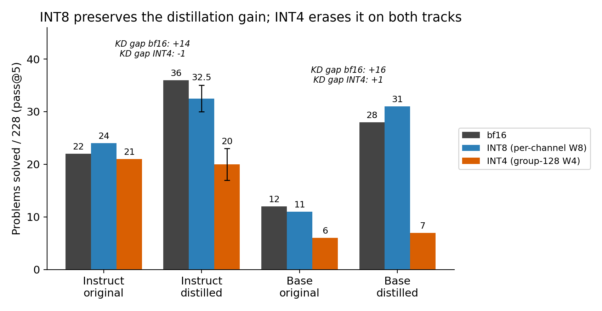
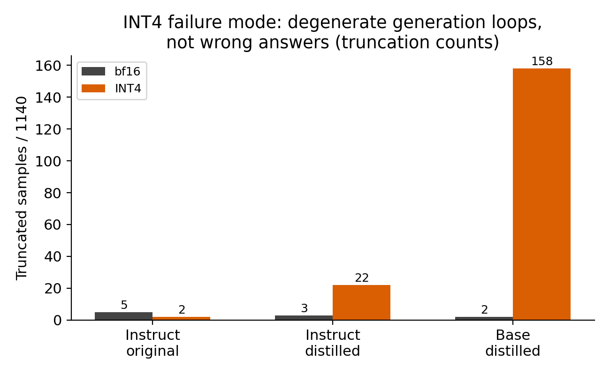
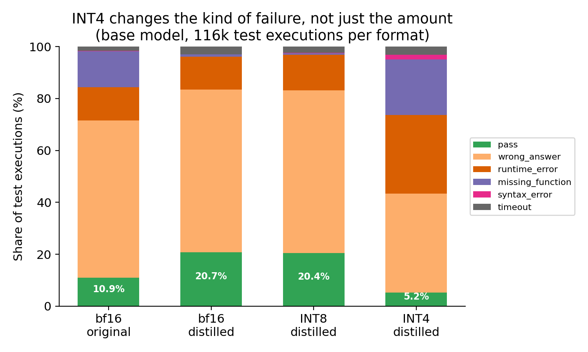
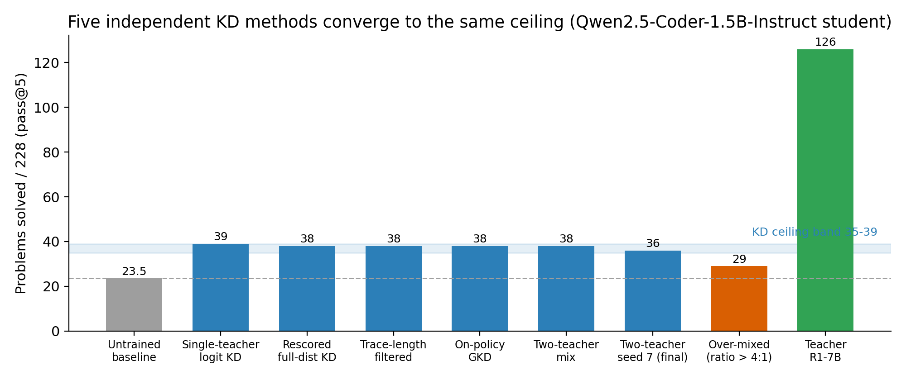
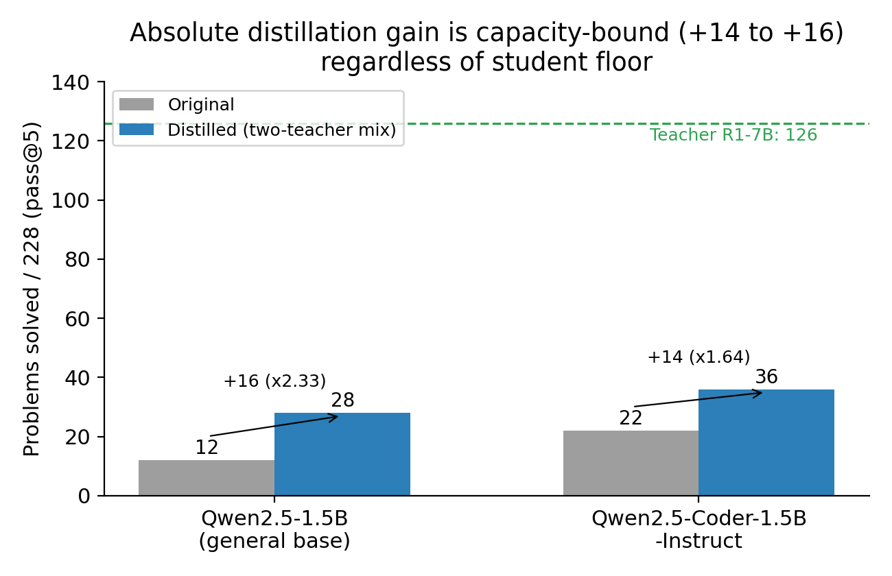

# Progress Report — July Week 4 (2026-07-22 to 2026-07-29)

## Summary

Completed the post-training quantization study across both student tracks, and began the QEAD ablation.

**Headline finding: INT4 quantization erases the entire gain from knowledge distillation. INT8 preserves it completely.**

---

## 1. How Quantization Was Applied

Real compressed INT8 checkpoints load in vLLM 0.6.6 but generate garbage. The checkpoints themselves are byte-correct, so the fault is in vLLM's reader, not the writer.

We therefore use **simulated quantization**: round each weight to the target precision, then convert back to bf16. The model is numerically identical to what real weight-only quantization would produce, so accuracy measurements are valid. Only the memory savings are not captured.

| Mode | Granularity |
|---|---|
| INT8 | Per-channel symmetric |
| INT4 | Group-128 symmetric |

`lm_head` is excluded in both modes.

---

## 2. The Quantization Grid

All numbers are **problems solved out of 228, pass@5, temperature 0.6**. Cells with two values were sampled twice with different seeds to separate real effects from sampling noise.

| Model | bf16 | INT8 | INT4 |
|---|---|---|---|
| Instruct original | 22 | 24 | 21 |
| Instruct distilled | 36 | 32.5 *(30, 35)* | 20 *(17, 23)* |
| Base original | 12 | 11 | 6 |
| Base distilled | 28 | 31 | 6 *(7, 5)* |

### What the grid says

The clearest way to read it is the **KD gap** — how far the distilled model leads its own original at each precision:

| Precision | Instruct gap | Base gap |
|---|---|---|
| bf16 | +14 | +16 |
| INT8 | ~+8.5 | +20 |
| INT4 | **−1** | **+1** |

At bf16 distillation is worth +14 and +16 problems. At INT4 that advantage is gone on both tracks — the distilled model and the untrained model score the same.

Meanwhile the *original* models barely move (instruct 22 → 21). The pretrained backbone survives 4-bit rounding; only the distilled knowledge is destroyed. This is a sharper claim than "distilled models degrade more," and it holds on two independent tracks.

---

## 3. INT8 Is Free

The instruct-distilled INT8 result first came in at 30, down from 36, which looked like real degradation. A second sampling draw scored 35. The draws {30, 35} overlap the bf16 noise band.

The decisive evidence is the test-case pass rate: **24.3% at bf16 vs 24.4% at INT8**, measured over ~19,000 test executions. Per-test competence is unchanged. Solve-count swings of ±3-6 are sampling noise with no mechanism behind them.

**Conclusion: at 1.5B, INT8 weight quantization costs nothing — for original, distilled, and base models alike.** This is the deployment recommendation.

---

## 4. How INT4 Breaks the Model

INT4 does not just lower accuracy. It changes what kind of output the model produces.

### Degenerate generation

| Model | bf16 truncated | INT4 truncated |
|---|---|---|
| Instruct original | 5 | 2 |
| Instruct distilled | 3 | 22 |
| Base distilled | 2 | 158 |

Base-distilled INT4 falls into repetition loops. Some outputs are nested brackets deep enough to overflow CPython's parser.

### Failure mixture (base track, ~116k test executions per format)

| Category | bf16 original | bf16 distilled | INT8 distilled | INT4 distilled |
|---|---|---|---|---|
| pass | 10.9% | 20.7% | 20.4% | 5.2% |
| wrong_answer | 60.7% | 62.7% | 62.7% | 38.2% |
| runtime_error | 12.7% | 12.7% | 13.8% | 30.3% |
| missing_function | 14.0% | 0.9% | 0.6% | 21.4% |
| syntax_error | 0.1% | 0.0% | 0.1% | 1.7% |
| timeout | 1.6% | 3.0% | 2.4% | 3.2% |

Two things fall out of this table:

**INT8 is identical to bf16 in every category.** wrong_answer 62.7% vs 62.7%, pass 20.7% vs 20.4%. There is no mechanism behind the solve-count difference — mechanical proof that it is noise.

**INT4 changes the type of failure.** wrong_answer is the *competent* failure mode: clean, running code with wrong logic. It drops from 62.7% to 38.2%, while structural breakage explodes — missing_function 0.9% → 21.4%, runtime_error 12.7% → 30.3%. A bf16 or INT8 distilled model fails like a programmer with wrong ideas. An INT4 distilled model fails like a broken text generator.

---

## 5. QEAD Ablation — Instruct Track

Trained a QEAD-off student (uniform per-token weights instead of quantization-error weights; everything else identical).

| Variant | bf16 | INT4 | Drop |
|---|---|---|---|
| QEAD-on | 36 | 20 *(17, 23)* | −16 |
| QEAD-off | 30 | 16 | −14 |

Two observations, both provisional until the base track finishes:

- **QEAD-off scores 6 lower at bf16** (30 vs 36). If real, QEAD helps the distillation itself, independent of quantization. This sits at the edge of the noise band and needs a second draw.
- **The INT4 drop is the same size in both** (−16 vs −14). QEAD's lead is carried forward under quantization, not widened. That is not what protection would look like.

---

## 6. Verified-116 Numbers for the Base Track

The verified-116 subset excludes the 112 problems with broken reference solutions, and is the paper's headline metric. Base-track numbers were measured for the first time this week.

| Model | 228-set | Verified-116 | Verified pass@5 |
|---|---|---|---|
| Base original | 12 | 11 | 9.5% |
| Base distilled | 28 | 27 | 23.3% |

---

## 7. Framing Decision

Decided to lead the paper with the **base track** rather than the instruct track.

The base result is the more striking claim: a general-purpose model with no code specialization reaches 28/228 after distillation, **beating Qwen2.5-Coder-1.5B-Instruct's native 22/228** — a model explicitly fine-tuned for code.

The instruct track stays as the ceiling evidence, because that evidence only exists there (five converging methods, the on-policy probe, 96.6% token agreement). No experiments change; only which result the abstract leads with.

---

## 8. Context From Earlier Work

### The KD ceiling is exhausted

Five independent distillation methods converge to the same 35-39 band on the instruct student. On-policy GKD found 96.6% teacher-student token agreement — at this capacity the teacher has nothing left to transfer.

### The gain is capacity-bound

| Track | Original | Distilled | Absolute | Relative |
|---|---|---|---|---|
| Instruct | 22 | 36 | +14 | ×1.64 |
| Base | 12 | 28 | +16 | ×2.33 |

Both tracks gain roughly the same absolute amount regardless of where they start. The base track's relative gain is far larger, and its distilled model overtakes the instruct original.

### The base track has its own ceiling

Three recipes (v1 mix 25, v2 28, two-stage 26) land in a 25-28 band, and a seed rerun of v2 reproduced 28 exactly. Capacity-bound, not recipe-bound.

---

## 9. What's Left

| Task | Status |
|---|---|
| QEAD-off base training | Running |
| QEAD-off base bf16 eval | Blocked on training — expect the 25-28 band |
| QEAD-off base INT4 eval | Blocked on training — the decisive number against QEAD-on's 6 |
| Second draw, instruct QEAD-off bf16 | Pending — settles whether the +6 is real |
| 2×2 ablation figure | After evals |
| Paper §1-§5 | Ready to draft, fully data-backed |
| Paper §6 (QEAD ablation) | Awaiting both tracks |

The open question is whether QEAD provides any real quantization protection. If the base track shows QEAD-off collapsing further than QEAD-on's 6, the method has a defensible effect. If the two land together, the fragility is inherent to distillation and the paper reports that, with INT8 robustness as the practical recommendation.
