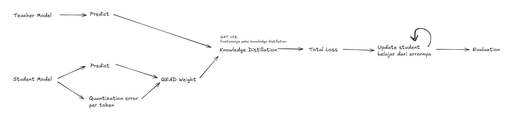

## Roadmap

## Related Paper 
### On-Policy Distillation of Large Language Models (arxiv.org/abs/2306.08543)
- Metodenya pake 'Forward KL Divergence' untuk loss functionnya jadi studentnya dipaksa mencocokkan seluruh distribusi probabilitas teacher termasuk bagian yang probabilitasnya hampir nol
- Dipaper ini blg kena masalah 'exposure bias', pas trainnig studentnya belajar dari teksnya tapi pas inference student harus generate token dari outputnya sendiri, lets say di token ke 5 salah maka errornya terus append sampai ga pernah belajar recover dari errornya, jadinya mereka ganti dari Forward KLD jadi Reverse KLD
- Forward KLD -> Sampling dari teacher, jadi student dipaksa cover semua yang teacher tau
- Reverse KLD -> Sampling dari student sendiri -> jadi student cukup fokus di output yang student anggap probable
- Student generate output -> Teacher score output nya -> Hitung reverse KLD -> update student weight
### Towards Streamlined Distillation for Large Language Models (arxiv.org/abs/2402.03898)
- Problemnya ada 2, Training lama banget & Ga ada loss function yang universally optimal
- Mereka pake metode 'Skew KLD', based on theory loss function yang baru dan lebih stabil, daripada student harus langsung sama kea teacher, mereka buat campuran antara teacher dan student sendiri jadinya si student belajarnya step by step mendekati si teacher bukannya kea yang lain (langsung lompat)
- Pake Adaptive Off-Policy (reuse generated data) -> simpan 'buffer' dari generated samples sebelumnya dan reuse secara adaptif, kalau samplenya udah terlalu out of distribution(studentnya udah berubah jauh sejak sample itu dibuat) baru di discard 
### Adaptive Chain-of-Thought Distillation Based on LLM Performance (mdpi.com/2227-7390/13/22/3646)
- Small LLM tidak selalu benefit kalau dikasi COT makanya di paper ini mereka ngecheck dulu difficultynya dulu kalau easy ya pakai short COT, kalau susah Long COT 
### Distilling Domain Knowledge for Efficient Large Language Models (neurips.cc/virtual/2024/poster/93067)
- Dataset distillation static ga effesien, studentnya mungkin udah bagus di domain tertentu tapi masih di latih dengan proporsi data yang samaa jadinya mereka pake DDK (Dataset distillation knowledge) dynammic

